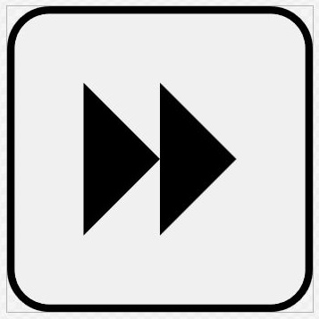
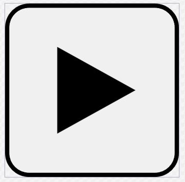
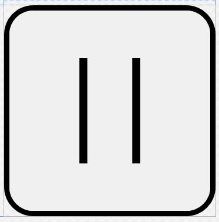
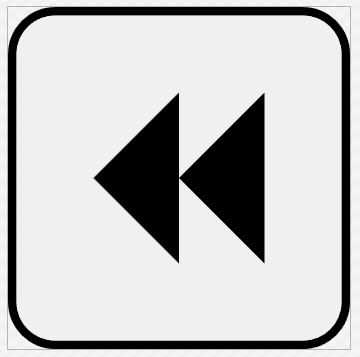
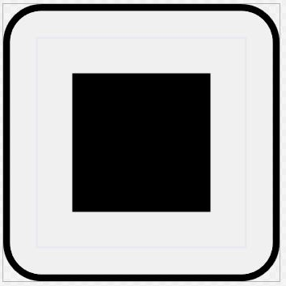
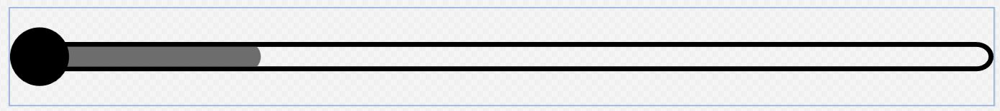

# RMControls
WPF library controls for windows Forms app

## Description
At the moment, the library contains only player controls - RMControls.Player.

### RMControls.Player

#### BtnForward

#### BtnPlay

##### Option A - play button

##### Option B - pause button

#### BtnReverse

#### BtnStop

#### Slider
